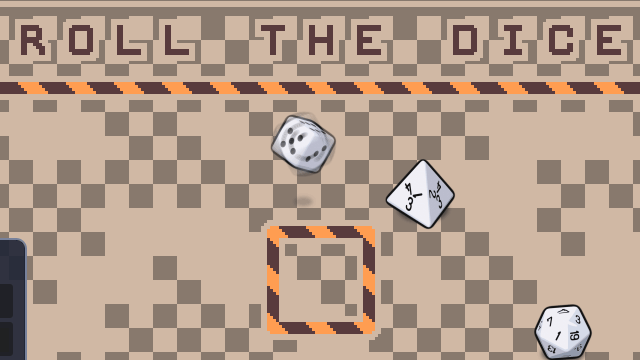
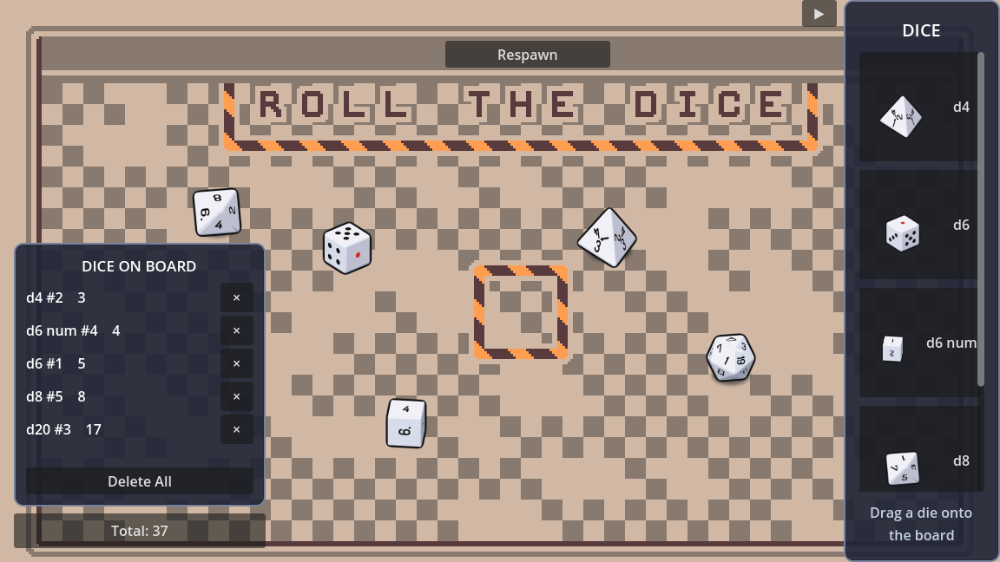

# First Game — a physics dice sandbox in Godot 4 + C#


Drag any of **eight dice** — d4, d6, d8, d10, d12, d20, a numbered d6 and a percentile d10 —
from the right-side palette, sling them across a pixel-art board, and let go: they tumble, land
and report a number. My first project in **Godot 4**, written in **C#** in May–June 2025 while
learning the engine's 2D physics: `RigidBody2D`, `PinJoint2D` mouse dragging, `Area2D` bounds
detection and `AnimatedSprite2D`.



## Controls

| Input | Action |
|---|---|
| **Tab** or **right-edge arrow** | open or close the dice palette |
| **Drag a die from the palette** | add another die to the board |
| **Hover a palette die** | name it — the two pairs that share a shape are told apart here |
| **Right-click a die** | open its menu: what it is, what it shows, and Roll / Theme / Copy / Link / Delete |
| **Link**, on either d10 | pick the other one; the pair then reads as one **d100**, 1–100% — and thereafter picks up, moves and throws as one |
| **R** with a die under the cursor | roll that one die where it stands |
| **C** with a die under the cursor | take a copy; the next left-click puts it down |
| **Shift** while placing a copy | keep it on the cursor and stamp another |
| **Escape** | close the menu, or drop a copy you have not placed |
| **Left-click and drag the die** | grab it — a pin joint follows the cursor |
| **Move a held die about** | spin it up: gentle movement plays `idle0`, sharp movement `idle1`. Once spinning it keeps tumbling in your hand until you let go |
| **Release the left button** | a die you spun rolls; a die you never agitated just sits where you dropped it |
| **Hold Shift, then drag a die** | select and throw every die together |
| **Space** | throw every die — they scatter across the board as well as rolling, including any still mid-roll |
| **Hover a die on the board** | a small tag by the cursor names it and the number it is showing |
| **Total button** | open or close the bottom-left die list |
| **Hover a die-list row** | highlight its die on the board |
| **× in a die-list row** | remove that die |
| **Delete All** | remove every die from the board |
| **"Respawn" button** | arrange all dice near the centre and kill their velocity |

There is no score and no way to lose. It is a toy, not a game.



## Status

**It builds and runs.** Verified on 2026-08-18 against Godot 4.4.1 (.NET build) and the
.NET 8 SDK: `dotnet build` completes with **0 warnings, 0 errors**, and a 240-frame headless
run of `game.tscn` starts clean with no errors or warnings. The dice state machine was
checked by 20 assertions driven headlessly — see [CLAUDE.md](CLAUDE.md).

It is **a dice sandbox and nothing more**, by decision rather than by omission. The board art
is a board game's board, and a `Player` script and a ring of eight cell coordinates survive in
the history to prove that was once the plan — but that plan was dropped in August 2026. Throw
dice, watch them tumble, read the numbers. See [ROADMAP.md](ROADMAP.md) items 3 and 4.

**The number is no longer a bare random draw**, though it is not physical either. It is
taken from the frame of the tumble the die was let go on, nudged by a random factor: the idle
loop covers every face across its length, so the moment you release picks a base face and
the jitter decides how near it you land. The roll animation resumes from that same frame, so
the spin you were watching carries into the throw. A throw can be influenced but not aimed,
and the die stays fair.

What that does **not** do is read the number off where the die physically stops — that is
still the honest fix, and [ROADMAP.md](ROADMAP.md) item 1 records a full implementation that
was built, tested and then deliberately reverted as more machinery than this toy warrants.

## Running it

Requires the **.NET / Mono build** of Godot — the standard build cannot run C# projects.

```bash
# Godot 4.4.1 (.NET), with the .NET 8 SDK on PATH
godot --path .            # or: open project.godot from the Godot project manager
```

To build the C# assembly on its own:

```bash
dotnet build FirstGame.csproj
```

Exporting a Windows binary uses the committed preset, which writes to `builds/`
(gitignored).

**There is no browser demo, and there cannot be one while this stays in C#.** Godot's own
documentation is blunt: *"Projects written in C# using Godot 4 currently cannot be exported
to the web."* The installed `4.4.1.stable.mono` template set has no web templates at all.
A playable Pages demo means getting the gameplay into GDScript. The plan is a hand-written
port in a second tree under `web/`, with C# staying canonical and CI checking the two do
not drift — [ROADMAP.md](ROADMAP.md) item 9, the largest piece of work left.

## Layout

```
scenes/     game.tscn (board, walls, bounds area, UI), dice.tscn, Player.tscn
scripts/    GameManager.cs   drag/release, respawn, bounds, copy placement
            Dice.cs          roll result + face animations
            DicePalette.cs   right-side drag-to-spawn dice menu
            DiceHud.cs       sorted die values, total and deletion controls
            DiceMenu.cs      the right-click menu for one die
            Player.cs        board-piece stub, unused (board game dropped)
assets/     dice/            die animation frames, a folder per die:
                             d4 d6 d6n d8 d10 d10p d12 d20
                             (see docs/ASSETS.md)
            petixel-prototype/  tileset and figures
            kenney-boardgame/   chip and piece sprites (CC0)
tools/      dice-render/     offline Blender pipeline that produces assets/dice/
            screenshots/     regenerates the two images below, deterministically
docs/       screenshot.png and roll.gif (both generated), asset provenance
```

The gameplay and runtime UI are implemented in C#.

## Known limitations

Everything here was reproduced by running the project, not inferred from reading it.

- **The result is still not physical**, though no longer a bare draw: it comes from the
  tumble frame the die was released on plus a random factor. It is not read off where the
  die actually stops. See [ROADMAP.md](ROADMAP.md) item 1.
- ~~**The result is invisible in-game.**~~ Fixed: `DiceHud` lists every die with its value
  and a running total. The spare `Label` in `game.tscn` is still unused, though — the HUD
  was built instead of binding it.
- ~~**The die can re-roll itself.**~~ Fixed: `idle0`/`idle1` now play **only while a die is
  held**, so a free die is never left in an idle state for anything to observe and act on.
  Rolls start from exactly three places: releasing a die you spun, a hard enough die-to-die
  collision, and Space.
- ~~**The die tunnels through the walls on fast throws.**~~ Fixed in August 2026 by enabling
  continuous collision detection (`continuous_cd`, off by default in Godot). Measured: dice
  started escaping at 8,000 px/s and now survive 400,000 px/s, with ordinary throws unchanged
  to the pixel. The out-of-bounds recovery stays, and no longer has anything to recover from.
- ~~**Dragging could push dice out of the board.**~~ Fixed at the same time. The mouse pin is
  clamped to the playable rectangle, which is derived from the wall colliders rather than
  hardcoded, so a cursor dragged off-board leaves the die resting against the wall instead of
  hauling it 421px through. Shift-dragging no longer freezes and teleports dice either — they
  are steered, and gathered into a clump at the cursor rather than holding the arrangement
  they were picked up in, so a pile against a wall settles instead of straining to get out.
- **`BodyExited` still fires once during scene teardown**, on the same frame as `_ExitTree`,
  where the deferred recentre can never be flushed. It is now silent — the handler prints
  nothing, so it no longer muddies the console — but the event is still unguarded.
- **Nothing moves until you touch it.** Gravity is disabled (top-down board), so the opening
  scene is completely static: 1,800 consecutive rendered frames are byte-identical.
- **The board game was dropped**, so `Player.cs`, `scenes/Player.tscn` and the two Kenney
  piece sprites are dead weight kept for now. See [ROADMAP.md](ROADMAP.md) item 3.
- **No tests, no CI.** Nothing is committed. Each change to the die has been verified with a
  throwaway headless harness — 21 checks on the current build — that is then deleted. The
  recipe is in [CLAUDE.md](CLAUDE.md), and making it permanent is the cheapest real
  improvement available here.
- ~~**Console output is in Ukrainian.**~~ No longer true: there is no non-ASCII text left in
  `scripts/`, and the one remaining `GD.Print` is `"Rolled: " + result`.
- ~~**`CollisionShape2D` was scaled 6×.**~~ Fixed: the die now uses an unscaled 32 px-radius
  collider that follows the visible body more closely.
- ~~**The die artwork is third-party with unknown terms.**~~ Fixed in August 2026: the
  animation was re-rendered from a CC0 model — see [docs/ASSETS.md](docs/ASSETS.md).

`KNOWNISSUES.md` carries the same list with the measurements; `ROADMAP.md` records where the
project is heading.

## History

One commit, `import to github` (2025-06-01) — the project was developed locally and pushed
in a single dump, so there is no incremental history to read.

A cleanup pass in July 2026 touched packaging only and **changed no behaviour** (proved by
re-rendering: 1,800 frames byte-identical before and after). It removed 2,698 committed
asset files that no scene referenced — two whole Kenney packs, of which exactly two files
were in use — along with a stray editor temp file, 26 lines of commented-out code and three
dead fields; renamed every path containing a space or a `!` (`First Game.csproj` →
`FirstGame.csproj`, `assets/Petixel Prototype 48x48/!Prototype_Characters.png` →
`assets/petixel-prototype/prototype-characters.png`); fixed the `ide0`/`ide1` animation
names to `idle0`/`idle1`; and pointed the export preset at `builds/` instead of a
mistyped `../Relises/` outside the repository. The tree went from **2,741 tracked files to
43**.

The pre-cleanup state is tagged **`v0.1-original`**.

August 2026 was the first pass that **did** change behaviour. The die animation was
re-rendered from a CC0 model, settling the one licensing question and cutting the artwork
from 18.6 MB to 3.9 MB (ROADMAP 6). The board then grew multiple dice, a drag-out palette
and a value HUD, which closed ROADMAP 2. `Dice.cs` was rewritten as an explicit three-state
machine after the drag work left it freezing on a single frame — the cause was
`AnimatedSprite2D.Stop()` rewinding to frame 0 where `Pause()` was meant, and the workaround
code built on top of that had been fighting a stall it was itself causing.

Then the die-rendering pipeline was generalised off the d6 it had been written for, and
**every other die in the source pack** was added — a d4, d8, d10, d12, d20, a numbered d6 and a
percentile d10 (ROADMAP 8). Nothing in the game knows a face count, a die's name, or what a face
is worth: `Dice.cs` counts a die's faces from its own animation clips, the palette and the die
list name each one from the die itself, and a ninth would be an entry in
`tools/dice-render/dice_config.py`, two tables read off a contact sheet, and a render run.

## Licence

[MIT](LICENSE) for the code, and for the die frames under `assets/dice/`, which were
rendered for this repository from a CC0 model. **Not** for the rest of the artwork — see
[docs/ASSETS.md](docs/ASSETS.md), which still includes one asset set whose origin could not
be established.
